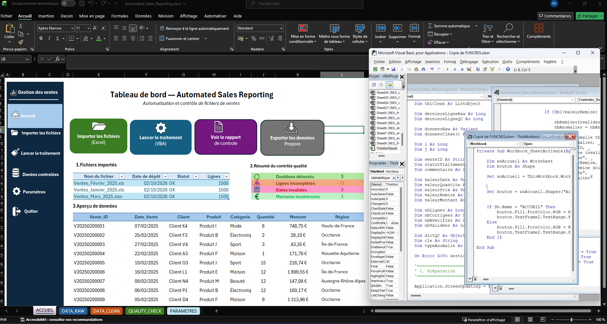

# 📗 Excel / VBA — Automated Sales Reporting

## 🎯 Objectif

Cette partie du projet utilise Excel et VBA afin d'automatiser le contrôle et la préparation des données commerciales.

L'objectif est de réduire les contrôles manuels et de fiabiliser les données avant leur traitement avec Python et leur analyse dans Power BI.

## ⚙️ Fonctionnalités

* Importation des données
* Contrôle de la qualité des données
* Détection des valeurs manquantes
* Détection des doublons
* Contrôle des données incohérentes
* Automatisation des contrôles avec VBA
* Organisation des résultats dans des feuilles dédiées

## 📂 Fichier

`Automated_Sales_Reporting.xlsm`

Le fichier Excel contient les feuilles et macros nécessaires à l'automatisation du processus de contrôle.

## 🔄 Processus

```text
DATA_RAW
   ↓
Contrôles VBA
   ↓
QUALITY_CHECK
   ↓
Données contrôlées
```

## 🧠 Compétences démontrées

* Excel avancé
* VBA
* Automatisation
* Data Quality
* Contrôle des données
* Structuration d'un processus de reporting

## 📸 Aperçu


