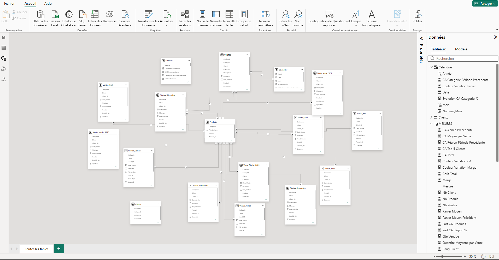
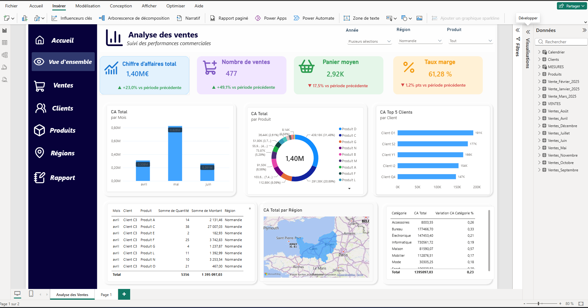

# 📊 Automated Sales Reporting

## 🎯 Présentation

Ce projet consiste à concevoir une solution complète d'automatisation du reporting commercial, depuis le contrôle et le nettoyage des données jusqu'à leur analyse et leur visualisation dans Power BI.

L'objectif est de transformer des données commerciales brutes en informations fiables et exploitables pour faciliter le suivi des performances et la prise de décision.

## 🔄 Workflow

```text
Données brutes
      ↓
Excel / VBA
Contrôle & automatisation
      ↓
Python
Profiling & nettoyage
      ↓
Données propres
      ↓
Power BI
Modélisation & analyse
      ↓
Dashboard commercial
```

## 🛠️ Technologies utilisées

* **Excel / VBA** — automatisation et contrôle des données
* **Python / Pandas** — profiling et nettoyage des données
* **Power BI** — modélisation, DAX et visualisation
* **Git / GitHub** — versionnement et documentation

## 📁 Structure du projet

* `Excel_VBA/` : automatisation et contrôles réalisés avec Excel/VBA
* `Code_Python/` : scripts de profiling et de nettoyage
* `Data/` : données d'entrée et exemples
* `Screenshots/` : captures du processus et du dashboard

## 📈 Fonctionnalités

### Excel / VBA

* Contrôle de la qualité des données
* Détection des anomalies
* Automatisation des traitements
* Génération de contrôles structurés

### Python

* Analyse exploratoire des données
* Détection des valeurs manquantes
* Détection des doublons
* Contrôle des types de données
* Nettoyage et préparation des données

### Power BI

* Modélisation des données
* Création de KPI commerciaux
* Analyse du chiffre d'affaires
* Analyse des ventes par catégorie
* Suivi de l'évolution des performances
* Dashboard interactif

## 🖼️ Aperçu

### Processus Excel / VBA


### Modèle Power BI



### Dashboard Power BI



## 🎯 Objectifs professionnels

Ce projet permet de mettre en pratique plusieurs compétences recherchées dans les métiers de la Data et du Business Analysis :

* Data Quality
* Data Cleaning
* Data Analysis
* Business Intelligence
* Automatisation
* Reporting
* Analyse des KPI
* Compréhension des besoins métier

## 🚀 Résultat

La solution permet de passer de données commerciales brutes à un reporting structuré et interactif, en combinant automatisation, contrôle de qualité, traitement des données et Business Intelligence.

## 👤 Auteur

**Franck KOM**

Engineering Student — Information Systems Management

Domaines d'intérêt : **Data Analysis • Business Analysis • Business Intelligence • Digital Transformation**
